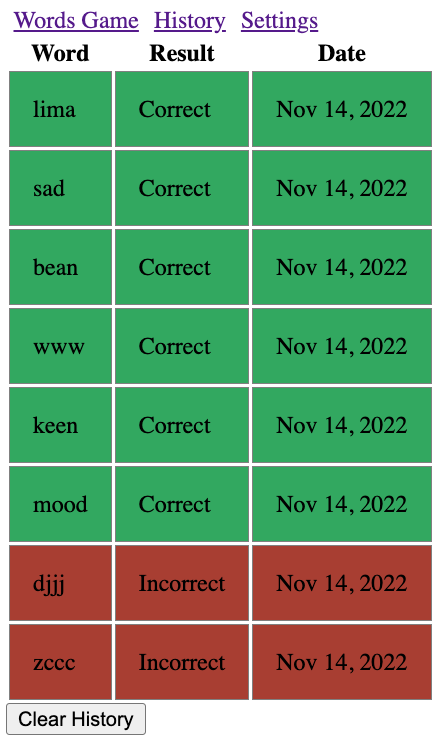
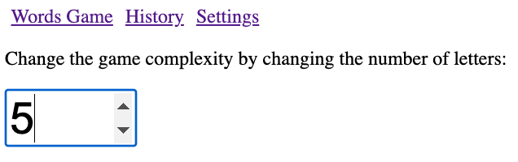

# Words Game

A Word Gessing game with Angular Framework. Please refer to the demo for how the game works.

### Backend

To start, download the provided code for the backend server, install the
dependencies `npm i`, then head to
[Oxford Dictionaties API](https://developer.oxforddictionaries.com/) and get
the personal API key, choose the free introductory package. Update `.env`
file with the application ID and Key.

```json
APP_ID="INSERT_YOUR_APP_ID_HERE"
APP_KEY="INSERT_YOUR_APP_KEY_HERE"
```

Start backend server `npm run start` and make sure it is listening to port
`3000`.\
This web server accepts requests to:

```http
GET /check/:word
```

And returns the following response:

```json
{
  "success": boolean,
  "data": {
    "valid": boolean
  }
}
```

The `valid` property indiciates whether the provided word is valid or not.

### Frontend Development

Create an Angular project that navigates the following components:

- `WordsComponent` _(default route)_
- `HistoryComponent`
- `SettingsComponent`

All three components share one reactive global state in a form of `Signal`,
which is always synched with the `localStorage`. The state has the following
structure/types and default value:

```ts
export enum GUESS_RESULT {
  Correct = "Correct",
  Incorrect = "Incorrect",
}

export interface ITry {
  word: string;
  result: GUESS_RESULT;
  timestamp: number;
}

export interface IState {
  complexity: number;
  win_count: number;
  loss_count: number;
  logs: ITry[];
}

export const INITIAL_STATE = {
  complexity: 5,
  win_count: 0,
  loss_count: 0,
  logs: [],
};
```

#### `WordsComponent`

- The `WordsComponent` show the scoreboard win and loss counts from the state.
- A placeholder for the answer:
  - A button to clear the answer.
  - When any letter is clicked, the letter will be removed.
- Button Controls: "Shuffle" + (Letters * complexity) + "Check".
  - The "Shuffle" button would select a new set of random letters without
    affecting the scoreboard (refer to the method below).
  - The number of letters buttons is based on the game complexity.
  - The "Check" button would send a request to the backend server and verify the
    selected word, which will affect the scoreboard and logs the results to the
    state.

<p align="center">
  
</p>


#### `HistoryComponent`

This component shows the state `logs`. A color directive is applied on each log
to change its background color to red/green based on the result.

<p align="center">
  
</p>

#### `SettingsComponent`

This components changes the game complexity to display different number of
letter-buttons. The complexity must be a value between 3 and 26, an error must
be displayed when the value is outside of that range.

<p align="center">
  
</p>


